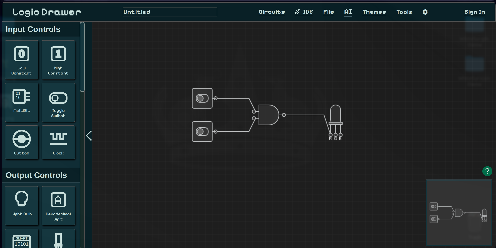

# LogicDrawer - Interactive Digital Logic Circuit Designer



[](package.json)
[]()
[](https://nodejs.org/)
[](https://www.typescriptlang.org/)

LogicDrawer is an interactive, web-based digital logic circuit designer and simulator.  
Perfect for students, educators, and engineers looking to design, simulate, and analyze digital circuits with ease.

---

## 🚀 Quick Features

- **Interactive Canvas**: Drag-and-drop circuit design with real-time simulation
- **AI-Powered Tools**: Generate circuits from sketches or natural language descriptions
- **Comprehensive Components**: Logic gates, adders, flip-flops, multiplexers, displays, and more
- **Analysis Tools**: Truth tables, Karnaugh maps, and signal flow visualization
- **Import/Export**: Verilog, JSON, PNG, PDF
- **Web-Based & Responsive**: Works on all modern devices

> For a full list of features, see our [Wiki](https://github.com/KaanAydinli/LogicDrawer/wiki).

---

## 🎯 Getting Started

### Prerequisites

- Node.js 16+ and npm
- Modern web browser
- (Optional) Python 3.8+ for AI features

### Installation

```bash
git clone https://github.com/KaanAydinli/LogicDrawer.git
cd LogicDrawer
npm install
cd server && npm install && cd ..
cp .env.example .env # Edit .env as needed
npm run dev:all   # Start frontend + backend
Open your browser at: http://localhost:4000
```

For detailed setup instructions and production deployment, see Wiki:

### 🤝 Contributing

We welcome contributions!

- Fork the repository
- Create a feature branch
- Make your changes and add tests if applicable
- Submit a Pull Request

See our Contributing Guide for more details.

### 📝 License

This project is licensed under AGPL v3. See LICENSE for details.

### 🙏 Acknowledgments

- Built with modern web technologies: TypeScript, Vite, Node.js, MongoDB
- Inspired by traditional circuit design tools
- Designed for education, accessibility, and community-driven development

#### ⭐ Star this repository if you find it useful!
