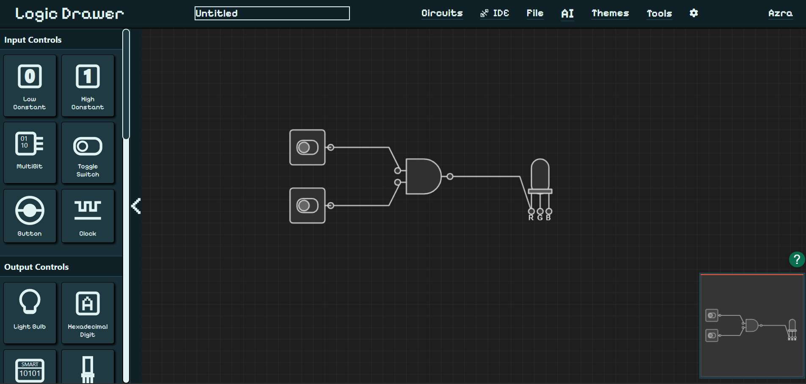

# LogicDrawer - Interactive Digital Logic Circuit Designer



[](package.json)
[]()
[](https://nodejs.org/)
[](https://www.typescriptlang.org/)

LogicDrawer is a comprehensive, web-based digital logic circuit designer and simulator featuring AI-powered circuit analysis, real-time simulation, and educational tools. Perfect for students, educators, and professionals working with digital logic circuits.

## 🚀 Features

### 🎯 Core Circuit Design
- **Interactive Canvas**: Drag-and-drop circuit design with zoom and pan capabilities
- **Real-time Simulation**: Live circuit simulation with instant feedback
- **Multi-bit Support**: Design circuits with customizable bit widths (1-bit to 64-bit)
- **Touch-Friendly Interface**: Optimized for tablets and mobile devices
- **Auto-Arrange**: Intelligent circuit layout optimization

### 🎨 Comprehensive Component Library

#### Logic Gates
- **Basic Gates**: AND, OR, NOT, NAND, NOR, XOR, XNOR
- **Buffer Gate**: Signal buffering with configurable delay
- **Multiplexers**: 2:1 and 4:1 MUX with select lines
- **Decoder**: Multi-bit decoder with configurable outputs
- **Configurable Inputs**: Dynamic input count adjustment (2-8 inputs)
- **Rotation Support**: 90° rotation for optimal layout

#### Input Components
- **Toggle Switch**: Persistent on/off state
- **Push Button**: Momentary activation
- **Clock Generator**: Configurable frequency (1Hz-10Hz)
- **Constants**: Constant 0 and Constant 1 sources
- **Multi-bit Input**: Grouped bit inputs for complex signals

#### Output Components
- **Light Bulb**: Simple on/off visual indicator
- **RGB LED**: Full-color display with 3-channel RGB control
- **7-Segment Display**: Hexadecimal digit display
- **Smart Display**: Programmable multi-mode display

#### Arithmetic Components
- **Half Adder**: Basic 1-bit addition
- **Full Adder**: 1-bit addition with carry
- **Half Subtractor**: Basic 1-bit subtraction
- **Full Subtractor**: 1-bit subtraction with borrow

#### Sequential Components
- **D Flip-Flop**: Edge-triggered storage element
- **D Latch**: Level-triggered storage element
- **Configurable Bit Width**: Support for multi-bit storage

#### Utility Components
- **Text Labels**: Customizable annotations and labels
- **State Indicators**: Visual status indicators
- **Wire Management**: Intelligent wire routing and bit-width negotiation

### 🤖 AI-Powered Features

#### Circuit Recognition
- **Image Analysis**: Upload hand-drawn circuit sketches
- **Automatic Component Detection**: AI identifies logic gates and components
- **Smart Reconstruction**: Converts sketches to working circuits
- **Connection Inference**: Automatically routes connections

#### Intelligent Assistant
- **Natural Language Processing**: Describe circuits in plain English
- **Circuit Generation**: AI creates circuits from descriptions
- **Problem Solving**: Get help with circuit design challenges
- **Educational Support**: Explanations and learning assistance

#### Advanced AI Tools
- **Circuit Optimization**: Suggest improvements and simplifications
- **Error Detection**: Identify and fix circuit issues
- **Pattern Recognition**: Detect common circuit patterns
- **Verilog Generation**: AI-assisted Verilog code creation

### 📊 Analysis Tools

#### Truth Table Generator
- **Automatic Generation**: Creates truth tables from circuits
- **Multi-output Support**: Handle complex circuits with multiple outputs
- **Export Options**: Save truth tables in various formats
- **Interactive View**: Click-to-edit truth table values

#### Karnaugh Map (K-Map)
- **Automatic K-Map Generation**: From circuits or truth tables
- **Minimization**: Find minimal Boolean expressions
- **Visual Grouping**: Interactive group selection
- **Export Functionality**: Save K-maps as images

#### Circuit Analysis
- **Signal Flow Analysis**: Visualize signal propagation
- **Timing Analysis**: Identify propagation delays
- **Power Estimation**: Calculate power consumption
- **Component Statistics**: Detailed circuit metrics

### 💾 Import/Export Capabilities

#### Verilog HDL Support
- **Verilog Import**: Load Verilog code into visual circuits
- **Verilog Export**: Generate Verilog code from circuits
- **Syntax Highlighting**: Built-in Verilog editor
- **Validation**: Syntax checking and error reporting

#### File Formats
- **JSON Export**: Complete circuit state preservation
- **Image Export**: High-quality PNG screenshots
- **PDF Export**: Professional documentation
- **Verilog (.v)**: Hardware description language

#### Cloud Integration
- **Circuit Repository**: Share circuits with the community
- **User Accounts**: Personal circuit libraries
- **Collaboration**: Share circuits with specific users
- **Version Control**: Track circuit revisions

### 🌐 Web-Based Architecture

#### Frontend
- **TypeScript**: Type-safe development
- **Vite**: Fast build tool and development server
- **Modern Canvas API**: High-performance rendering
- **Responsive Design**: Works on all devices

#### Backend
- **Node.js/Express**: RESTful API server
- **MongoDB**: Circuit storage and user management
- **JWT Authentication**: Secure user sessions
- **Python Integration**: AI/ML processing backend

#### Security
- **Input Sanitization**: XSS protection
- **Rate Limiting**: API abuse prevention
- **CORS Configuration**: Cross-origin request handling
- **Helmet Security**: Security headers

### ⌨️ Keyboard Shortcuts

#### File Operations
- `Ctrl + S`: Save circuit to file
- `Ctrl + O`: Open circuit file
- `Ctrl + E`: Export as Verilog
- `Alt + S`: Take screenshot

#### Editing
- `Delete/Backspace`: Delete selected components
- `Ctrl + A`: Select all components
- `Ctrl + Z`: Undo last action
- `R`: Rotate selected component

#### View Controls
- `+/=`: Zoom in
- `-`: Zoom out
- `0`: Reset zoom
- `Ctrl + G`: Toggle grid

#### Simulation
- `F5`: Run simulation
- `T`: Generate truth table
- `K`: Show Karnaugh map
- `A`: Auto-arrange circuit

### 🎓 Educational Features

#### Interactive Learning
- **Component Tooltips**: Detailed explanations
- **Visual Feedback**: Real-time signal visualization
- **Error Highlighting**: Common mistake identification
- **Progressive Complexity**: Start simple, build advanced

#### Teaching Tools
- **Circuit Templates**: Pre-built educational circuits
- **Step-by-Step Simulation**: Watch signals propagate
- **Comparative Analysis**: Before/after optimizations
- **Export for Presentations**: High-quality diagrams

### 🔧 Technical Specifications

#### System Requirements
- **Browser**: Modern web browser with Canvas support
- **Memory**: 2GB RAM minimum (4GB recommended)
- **Storage**: 100MB for offline operation
- **Network**: Internet connection for cloud features

#### Performance
- **Component Limit**: 1000+ components per circuit
- **Simulation Speed**: Real-time for most circuits
- **File Size**: Optimized JSON serialization
- **Rendering**: 60fps smooth interactions

## 🚀 Getting Started

### Prerequisites
- Node.js 16+ and npm
- Modern web browser
- (Optional) Python 3.8+ for AI features

### Installation

1. **Clone the repository**
   ```bash
   git clone https://github.com/KaanAydinli/LogicDrawer.git
   cd LogicDrawer
   ```

2. **Install dependencies**
   ```bash
   npm install
   cd server && npm install && cd ..
   ```

3. **Set up environment variables**
   ```bash
   # Create .env file in server directory
   cp server/.env.example server/.env
   # Edit .env with your configuration
   ```

4. **Start development servers**
   ```bash
   # Start both frontend and backend
   npm run dev:all
   
   # Or start individually
   npm run dev          # Frontend only
   npm run dev:server   # Backend only
   ```

5. **Open in browser**
   ```
   http://localhost:4000
   ```

### Production Deployment

1. **Build the application**
   ```bash
   npm run build:all
   ```

2. **Start production server**
   ```bash
   npm start
   ```

3. **Deploy to cloud platform**
   - Supports Netlify, Vercel, Heroku
   - Configure environment variables
   - Set up MongoDB connection

## 🎯 Usage Examples

### Basic Circuit Creation
1. Click component buttons to add gates
2. Drag components to desired positions
3. Click component ports to start wiring
4. Connect ports to complete circuits
5. Use properties panel to configure components

### AI Circuit Generation
1. Click the AI chat button
2. Describe your circuit: "Create a 2-bit adder"
3. Review the generated circuit
4. Modify as needed

### Verilog Import
1. Use `Ctrl + E` or file menu
2. Paste Verilog code
3. Circuit automatically generates
4. Fine-tune component positions

### Truth Table Analysis
1. Design your circuit
2. Press `T` or use Analysis menu
3. Truth table generates automatically
4. Export or use for K-map generation

## 🤝 Contributing

We welcome contributions! Please see our [Contributing Guide](CONTRIBUTING.md) for details.

### Development Setup
1. Fork the repository
2. Create a feature branch
3. Make your changes
4. Add tests if applicable
5. Submit a pull request

### Code Style
- TypeScript with strict type checking
- ESLint + Prettier for code formatting
- Conventional Commits for commit messages
- JSDoc comments for public APIs

## 📝 License

This project is currently private and proprietary. All rights reserved.

## 🙏 Acknowledgments

- Built with modern web technologies
- Inspired by traditional circuit design tools
- Community-driven feature development
- Educational focus and accessibility

## 📞 Support

- **Documentation**: [Wiki](https://github.com/KaanAydinli/LogicDrawer/wiki)
- **Issues**: [GitHub Issues](https://github.com/KaanAydinli/LogicDrawer/issues)
- **Discussions**: [GitHub Discussions](https://github.com/KaanAydinli/LogicDrawer/discussions)
- **Email**: support@logicdrawer.app

## 🗺️ Roadmap

### Version 1.1 (Planned)
- [ ] Advanced sequential circuit support
- [ ] Custom component creation
- [ ] Circuit performance profiling
- [ ] Collaborative real-time editing

### Version 1.2 (Future)
- [ ] FPGA synthesis support
- [ ] Advanced timing analysis
- [ ] Circuit testing framework
- [ ] Mobile app version

---

**LogicDrawer** - Making digital logic design intuitive, educational, and powerful.

*Star ⭐ this repository if you find it useful!*
